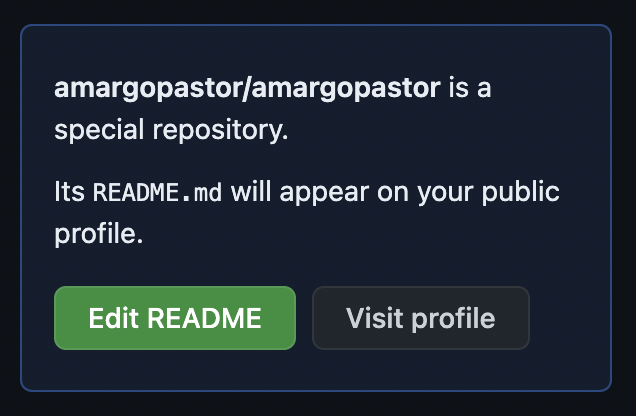
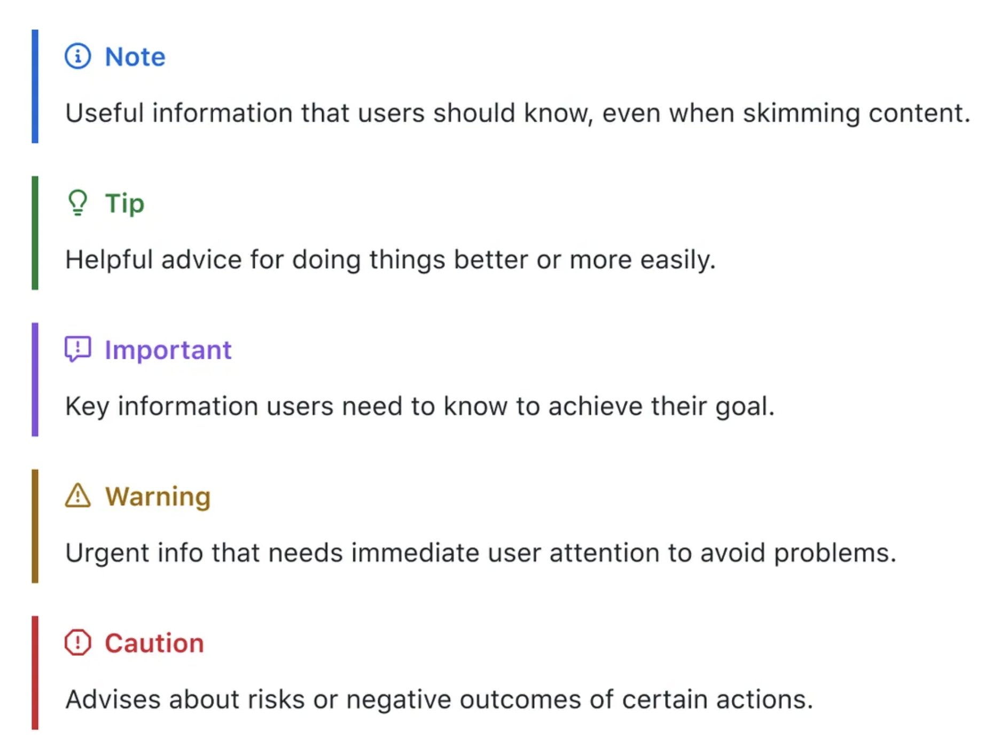
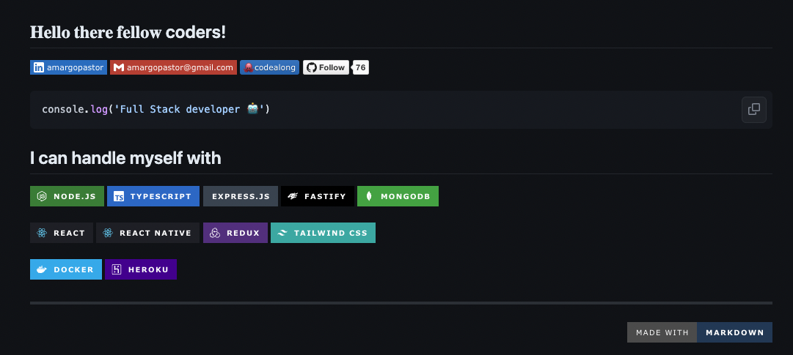
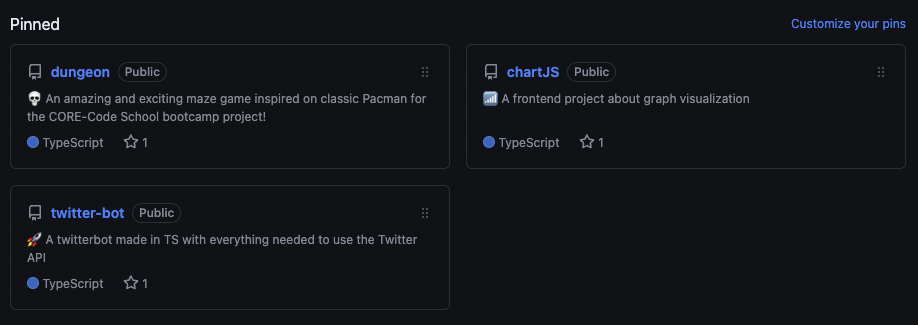
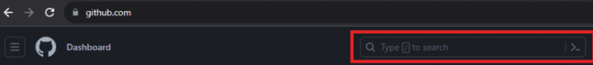
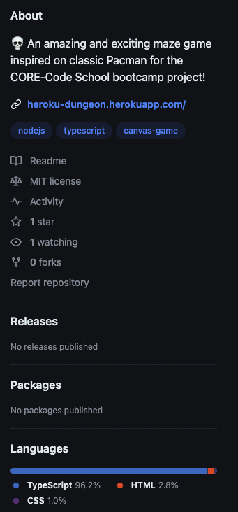
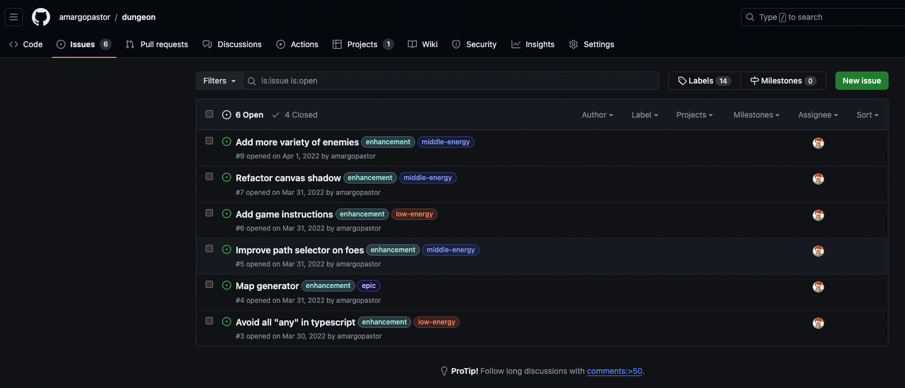
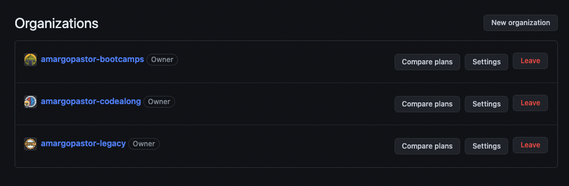
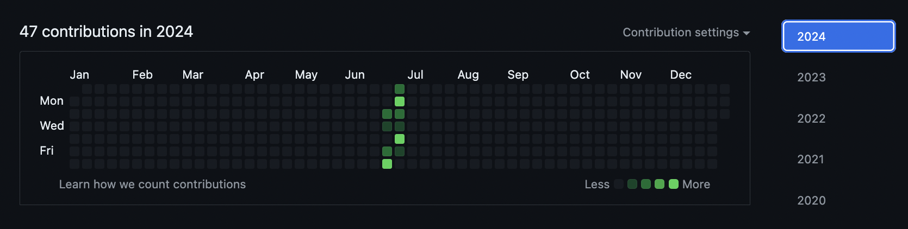
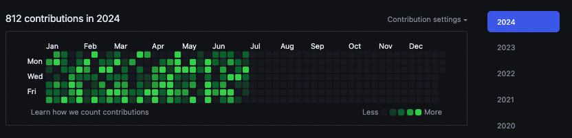

# ca-GitHub {

## Table of contents

1. [Introduction](#introduction)
1. [GitHub profile](#github-profile)
1. [Markdown](#markdown)
1. [Your profile](#your-profile)
   1. [Tags & Links](#tags--links)
   1. [Stats and Activity](#stats-and-activity)
   1. [Social Media & Co](#social-media--co)
   1. [Pinned](#pinned)
   1. [Contributions](#contributions)
1. [Good practices](#good-practices)
   1. [README](#readme)
   1. [Ordered repositories](#ordered-repositories)
   1. [No side projects](#no-side-projects)
   1. [Commits history](#commits-history)
   1. [.gitignore file](#gitignore-file)
   1. [GitHub Actions](#gitHub-actions)
1. [Repositories](#repositories)
1. [Organizations](#organizations)
1. [PixelHub](#pixelhub)
1. [Resources](#resources)
1. [Honorable mentions](#honorable-mentions)

## Introduction

A través del siguiente contenido y materiales trataremos de dar respuesta a la siguiente pregunta: **¿cómo potenciar mi perfil en GitHub?**

Como desarrolladores y desarrolladoras, a menudo tendremos que afrontar momentos o pruebas durante nuestra vida laboral que supondrán, entre otras cosas, el acceso a puestos, colaboraciones, formaciones e incluso tecnologías que nos ayudarán a progresar como profesionales del sector.

No sólo el esfuerzo y la paciencia serán nuestras aliadas, sino que además deberemos **saber compartir e incluso promocionar nuestro trabajo** a través de repositorios y perfil en la red de GitHub de manera atractiva, dinámica y profesional.

En las siguientes páginas veremos diseños, proyectos, tips, consejos y toda clase de información relevante que nos ayudarán a llevar nuestros repositorios al siguiente nivel.

> [!TIP]
> Te recomendamos que también visites la documentación acerca de [git-github](https://github.com/amargopastor-codealong/ca-git-github) y la [terminal](https://github.com/amargopastor-codealong/ca-terminal).

## GitHub profile

Lo primero que debemos hacer es crear nuestro propio perfil en GitHub. Para ello, habilitaremos un nuevo repositorio cuyo nombre empate con nuestro nombre de usuario en GitHub. Por ejemplo, si tu nombre de usuario es "amargopastor", el nombre debe ser "amargopastor".

<p>
  
</p>

Detalles que debes tener en cuenta:

- Has creado un repositorio con un nombre que empate con tu nombre de usuario de GitHub.
- Este repositorio es público.
- Este repositorio contiene un archivo de nombre README.md en su raíz.
- El archivo README.md contiene cualquier tipo de contenido.

Este README.md pasará a estar activo por defecto en nuestro perfil de GitHub y será tu nueva carta de presentación para todas las personas que visiten tu perfil. ¡Imagina la importancia de preparar bien este nuevo documento!

## Markdown

Pero, ¿exíste alguna manera de editar mis README.md para evitar un aburrido texto plano? Bienvenid@ al formato Markdown.

**Markdown es un lenguaje fácil de leer y escribir para aplicar formato a todos nuestros textos**. Podemos usar sintaxis Markdown, junto con algunas etiquetas HTML adicionales, para aplicar formato a la escritura en GitHub en lugares como los archivos README.md o los comentarios en las solicitudes de cambios y Pull Request.

Las posibilidades que nos ofrece este lenguaje de marcado son múltiples para poder [crear formatos sofisticados en nuestra prosa](https://docs.github.com/es/get-started/writing-on-github/getting-started-with-writing-and-formatting-on-github/basic-writing-and-formatting-syntax).

No olvidemos que, como desarrolladores, crear y compartir código será nuestro día a día por lo que es importante **sacar el máximo partido a las etiquetas de lenguaje**:

> html

```html
<!DOCTYPE html>
<html>
	<head>
		<title>HTML CSS JS</title>
	</head>
	<body>
		<h1 id="welcome">HTML CSS JS</h1>
		<p>Hello world</p>
	</body>
</html>
```

> css

```css
/* CSS styles */
h1 {
	font-family: Impact, sans-serif;
	color: #ce5937;
}
```

> js

```javascript
// JavaScript
document.getElementById('welcome').innerText += ' Editors';
```

Puede que también te interese alguna de las funcionalidades más destacadas:

<details>
  <summary>Alertas</summary>

Las alertas son extensiones del formato Markdown que podemos usar para enfatizar información crítica en nuestros documentos. GitHub pintará automáticamente cada una de las siguientes alertas con colores e iconos distintivos para subrayar la importancia de su contenido.

> [!NOTE]  
> Highlights information that users should take into account, even when skimming.

> [!TIP]
> Optional information to help a user be more successful.

> [!IMPORTANT]  
> Crucial information necessary for users to succeed.

> [!WARNING]  
> Critical content demanding immediate user attention due to potential risks.

> [!CAUTION]
> Negative potential consequences of an action.

<p>
  
</p>

</details>

<details>
  <summary>Tablas</summary>

| Command      | Description                                        |
| ------------ | -------------------------------------------------- |
| `git status` | List all _new or modified_ files                   |
| `git diff`   | Show file differences that **haven't been** staged |

</details>

</details>

<details>
  <summary>Emojis</summary>

Una de las mejores funcionalidades que nos facilita el formato Markdown es la posiblidad de incluir emojis :robot:

</details>

<details>
  <summary>Colapsar información</summary>

You just did it! :tada:

</details>

No dejes de explorar todas las posibilidades. Aquí tienes algunos conceptos avanzados para poner a prueba tus ficheros markdown:

> [!CAUTION]
> Crea tus propios [diagramas y mapas](https://docs.github.com/es/get-started/writing-on-github/working-with-advanced-formatting/creating-diagrams) y hecha un vistazo a la documentación oficial de [GitHub Flavored Markdown Spec](https://github.github.com/gfm/)

## Your profile

Ahora que sabemos como crear nuestro propio perfil en GitHub y estamos familiarizados con el formato Markdown, vamos a poner en práctica nuestros nuevos conocimientos creando [una página de presentación que sea atractiva, moderna y dinámica](https://github.com/amargopastor/amargopastor).

Esta página será una mezcla entre CV, portfolio y landing profesional. **Ajusta tu README.md al tipo de perfil que quieras proyectar**. Este sector busca todo tipo de personas: sé creativ@ pero ten siempre en mente a que tipo de trabajo/sector/tecnología a la que quieres acceder.

### Tags & Links

Las **tags** permiten crear marcadores visualmente claros a cerca de las tecnologías que trabajamos o las herramientas que utilizamos y los **links** te permitirán enlazar tus páginas de interés de manera rápida y accesible: linkeding, gmail, artículos y vídeos, entre otros.

<p>
  
</p>

Crea las tuyas propias con [awesome-badges](https://github.com/Envoy-VC/awesome-badges).

### Stats and Activity

> README.md

<!-- prettier-ignore -->
```html
<div align="center">

	<br />
	<br />
	

</div>
```

<div align="center">

<br/>
<br/>


</div>

### Social Media & Co

```bash
[](https://www.linkedin.com/in/amargopastor/)
[](mailto:amargopastor@gmail.com)
[](https://github.com/amargopastor-codealong)
[](https://github.com/amargopastor)
```

[](https://www.linkedin.com/in/amargopastor/)
[](mailto:amargopastor@gmail.com)
[](https://github.com/amargopastor-codealong)
[](https://github.com/amargopastor)

### Pinned

**'Pinea' tus repositorios destacados**: Puedes destacar aquellos proyectos que hayas creado o colaborado y de los que te sientas particularmente orgullos@, o simplemente porqué quieres postular a puestos cuyas tecnologías seguro conoces gracias a haberlas trabajado en estos mismos 'repos'.

<p>
  
</p>

Recuerda la norma: _si todo es especial nada realmente lo es_, o lo que es lo mismo, **destaca pocos repositorios y sólo aquellos que consideres realmente especiales**. Ten en cuenta que, muy probablemente, los visitantes a tu perfil centren su atención en aquellos 'repos' que tu recomiendes, no en los 400 que tengas creados en la pestaña correspondiente :wink:

### Contributions

Los proyectos de código abierto tienen un profundo impacto en el mundo del desarrollo de software. Fomentan un **ecosistema colaborativo con el intercambio de códigos, el aprendizaje mutuo y los avances tecnológicos**.

Como desarrolladores, contribuir a proyectos de código abierto en GitHub puede mejorar nuestras habilidades, ampliar nuestra red y mejorar nuestro currículum. A pesar de todas estas ventajas, contribuir a una comunidad de código abierto por primera vez puede resultar algo intimidante.

Para nuestra primera aproximación a la colaboración de proyectos 'open source', podemos seguir los siguientes pasos:

1. **Busca un proyecto adecuado**: uno que se alinee con tus habilidades, intereses y la tecnología con la que está sfamiliarizado o deseas aprender. Puedes emplear alguna de las siguientes herramientas:

   - [GitHub Explore](https://github.com/explore)
   - [Awesome Lists](https://github.com/topics/awesome)
   - [Personal List](https://github.com/stars/amargopastor/lists/opensource)
   - [Barra de búsqueda](https://github.com/)

    <p>
     
   </p>

2. **Contributing Guidelines**: Un paso esencial antes de realizar cualquier contribución es revisar las pautas de contribución del proyecto. Estas pautas generalmente se encuentran en un archivo llamado CONTRIBUTING.md, CONTRIBUTE.md o HOW_TO_CONTRIBUTE.md en el repositorio del proyecto. En algunos casos, también puede ser parte del archivo README.md.

En estos documentos podremos encontrar:

- Códigos de conducta
- Que contribuciones se esperan
- Proceso de Pull Request
- Estándar de código

Observa este ejemplo de repositorio para [crear líneas de contribución](https://github.com/jessesquires/.github/blob/main/CONTRIBUTING.md).

## Good practices

Nuestro perfil de GitHUb ha alcanzado la excelencia. Ahora es atractivo, dinámico y profesional. Vamos un paso más allá:

### README

Para cualquier proyecto que decidamos almacenar de manera profesional en GitHub todo README.md debe estar centrado siempre en comunicar la información más importante:

- Qué hace el proyecto
- Por qué el proyecto es útil
- Cómo pueden inicializar los usuarios el proyecto
- Dónde pueden recibir ayuda los usuarios
- Quién mantiene y contribuye
- Deployments :robot:

Si colocas tu archivo README en el directorio .github, raíz o docs oculto de tu repositorio, GitHub lo reconocerá y automáticamente expondrá tu archivo README a los visitantes del repositorio.

Hecha un vistazo al README de los siguientes proyectos:

- [Dungeon](https://github.com/amargopastor/dungeon)
- [ChartJS](https://github.com/amargopastor/chartJS)
- [Gallery-API](https://github.com/amargopastor/gallery-api)
- [Gallery-front](https://github.com/amargopastor/gallery-front)

### Ordered repositories

Procura ser **ordenado/a con tus repositorios**. Establece tu propio 'naming convention' que te permita orientarte rápidamente en tu página de 'repos'. Piensa no solo en ti, sino en cualquier visitante a nuestro perfil: queremos que la gente vea siempre todo nuestro trabajo de la mejor manera posible. Algunos consejos:

- Nombres claros y concisos
- Si el nombre puede orientarnos acerca del tipo de proyecto, mejor
- Usa las descripciones, topics y emojis para una mejor visualización
- Enlaza los deploys de tus proyectos! :robot:
- Implemente automatizaciones para trabajar de manera más efectiva. Por ejemplo, los flujos de trabajo de CI/CD pueden implementar versiones basadas en convenciones de nomenclatura.
- Todos los consejos vistos hasta ahora son perfectamente válidos para el [README.md de tus proyectos](https://github.com/amargopastor/dungeon/blob/main/README.md)

<p>
  
</p>

### No side projects

Necesitamos tratar todos nuestros proyectos con el mismo nivel de profesionalismo que lo haríamos con cualquier trabajo basado en un cliente. Esto puede resultar difícil ya que todas las metodologías y restricciones deberán ser auto-impuestas.

Ten en mente que no tiene sentido mostrar proyectos de los que no estés orgulloso: plantea siempre realizar un seguimiento de tus proyectos como lo haría con cualquier cliente.

Esta idea podemos aplicarla a cualquier punto de nuestro proyecto: desde READMEs profesionales, nuestro propio sistema de despliegue hasta el tratamiento de [issues](https://github.com/amargopastor/dungeon/issues), [labels](https://github.com/amargopastor/dungeon/labels) y [proyectos](https://github.com/amargopastor/dungeon/projects/1) al más puro estilo SCRUM master:

<p>
  
</p>

> [!TIP]
> There's No Such Thing as a [Side Project.](https://www.ianwootten.co.uk/2016/01/20/theres-no-such-thing-as-a-side-project/)

### Commits history

Un historial de commits limpio es crucial para una colaboración y una gestión de código eficaz. Nos proporcionará un registro claro de los cambios que se han realizado en el código base y ayuda a mantener este mismo código limpio y estable.

- **Mensajes descriptivos**: mensajes que expliquen el propósito y el contexto de los cambios que se han realizado.

- **Cambios atómicas**: cambios pequeños y enfocados que contengan una sola modificación lógica.

- **Formato coherente**: nuestros mensajes serán siempre imperativos y mantendrán una primera línea de 50 caracteres o menos.

> [!TIP]
> Siempre que sea posible, realiza tus commits en inglés.

> :x: Malas prácticas

```bash
git commit -m "Fixed stuff"

```

> :white_check_mark: Buenas prácticas

```bash
git commit -m "Add user authentication mechanism to the inventory management system"
```

### .gitignore file

El archivo .gitignore es una forma sencilla y eficaz de gestionar los archivos y directorios que desea excluir del control de versiones.

- Ignorar ficheros de compilación
- Ignorar información confidencial
- Ignorar archivos específicos del usuario
- Ignorar archivos grandes
- Ignorar registros y cachés
- Ignorar archivos de prueba

Puedes emplear es este generador on-line para tus ficheros [.gitignore](https://www.toptal.com/developers/gitignore)

## GitHub Actions

GitHub Actions es una de las característica de GitHub más útil, la cual nos permite automatizar tareas a través de flujos de trabajo. Proporciona una forma flexible y escalable de crear, probar e implementar código y nos ayuda a mantener una base de código limpia y estable.

GitHub Actions es una herramienta compleja y escalable (de la cual podríamos escribir largos artículos), pero nosotros vamos a centrarnos en describir alguno de sus valores más básicos:

- Automatización en procesos de compilación
- Automatización de pruebas
- Automatización en los procesos de despliegue
- Automatización de releases
- Automatización de la documentación
- Automatización IaC (tareas de infraestructura como código (IaC), aprovisionamiento, configuración e implementació)
- Automatice los controles de seguridad

## Repositories

Echa un vistazo a algunos de los 'repos' más interesantes de la comunidad en GitHub:

- [ParthJohri](https://github.com/ParthJohri)
- [anmol098](https://github.com/anmol098/anmol098)
- [Zhenye-Na](https://github.com/Zhenye-Na/Zhenye-Na)
- [guilyx](https://github.com/guilyx/guilyx)
- [codestackr](https://github.com/codestackr/codestackr)
- [timburgan](https://github.com/timburgan/timburgan?tab=readme-ov-file)
- [zumrudu-anka](https://github.com/zumrudu-anka/zumrudu-anka)
- [iampavangandhi](https://github.com/iampavangandhi/iampavangandhi)
- [rahul-jha98](https://github.com/rahul-jha98/rahul-jha98)
- [trinib](https://github.com/trinib/trinib)
- [holic-x](https://github.com/holic-x/holic-x)

Puedes ver la [lista completa en este enlace](https://github.com/abhisheknaiidu/awesome-github-profile-readme) :nerd_face:

## Organizations

Las [organizaciones son cuentas compartidas](https://github.com/settings/organizations) en las que las empresas y los proyectos de código abierto pueden colaborar en muchos repositorios a la vez, con características personalizadas de seguridad y administrativas.

<p>
  
</p>

## PixelHub

Si has llegado hasta aquí :wink: quizás te interese un pequeño script que nos ayuda a generar instantáneamente un completo gráfico de contribuciones durante el último año.

Las instrucciones son sencillas:

1. Crea un nuevo repositorio vacío en GitHUb. ¡Es importante que no lo inicialices!
2. Descarga la carpeta [github-activity-generator](https://github.com/Shpota/github-activity-generator/archive/master.zip)
3. Ejecuta el fichero 'contribute.py' (modifica user y repo por tu nombre de github y nombre del repo vacío, respectivamente):

```bash
python python contribute.py --repository=git@github.com:user/repo.git
```

Puedes editar las contribuciones con algunos comandos especiales:

> Sin código los fines de semana:

```bash
python contribute.py --no_weekends --repository=git@github.com:user/repo.git
```

> Especifica los días anteriores y posteriores desde el 'current date':

```bash
python contribute.py --days_before=10 --days_after=15 --repository=git@github.com:user/repo.git
```

> :unamused: Antes:

<p>
  
</p>

> :sunglasses: Después:

<p>
  
</p>

> [!NOTE]  
> DISCLAIMER: Ten en cuenta que un vistazo rápido es suficiente para comprobar que el gráfico generado proviene de commits vacuos. No se trata de engañar a nadie sino de explorar alternativas, herramientas y reflexionar sobre las apariencias y la auténtica dedicación.

## Resources

### README & Markdown

- Cómo [administrar el README de tu perfil](https://docs.github.com/es/account-and-profile/setting-up-and-managing-your-github-profile/customizing-your-profile/managing-your-profile-readme) según la documentación del propio GitHub

- Obtén información sobre las [características de formato avanzadas](https://docs.github.com/es/get-started/writing-on-github/getting-started-with-writing-and-formatting-on-github/quickstart-for-writing-on-github) mediante la creación de un archivo README.md para el perfil de GitHub

- Crear [formatos sofisticados](https://docs.github.com/es/get-started/writing-on-github/getting-started-with-writing-and-formatting-on-github/basic-writing-and-formatting-syntax) en nuestra prosa

- Enfatiza y distingue tu contenido con esta [emoji-cheat-sheet](https://github.com/ikatyang/emoji-cheat-sheet/blob/master/README.md#table-of-contents) o visita [webfx.com](https://www.webfx.com/tools/emoji-cheat-sheet/)

- Puedes [colapsar información](https://gist.github.com/pierrejoubert73/902cc94d79424356a8d20be2b382e1ab) en tus README.md

- No te olvides de [organizar la información en tablas](https://docs.github.com/es/get-started/writing-on-github/working-with-advanced-formatting/organizing-information-with-tables) para una mejor comprensión de los conceptos

- Lee atentamente las [recomendaciones del propio GitHub](https://docs.github.com/es/repositories/managing-your-repositorys-settings-and-features/customizing-your-repository/about-readmes) en materia de README.md

- Aquí tienes [5 consejos para hacer tu perfil de GitHUb más accesible](https://github.blog/2023-10-26-5-tips-for-making-your-github-profile-page-accessible/)

- Look! [Markdown Cheatsheet](https://github.com/adam-p/markdown-here/wiki/Markdown-Cheatsheet)

- Crea tus propios [diagramas y mapas](https://docs.github.com/es/get-started/writing-on-github/working-with-advanced-formatting/creating-diagrams)

- [GitHub Flavored Markdown Spec](https://github.github.com/gfm/)

- Watch out! [Awesome-readme](https://github.com/matiassingers/awesome-readme?tab=readme-ov-file)

- Las mejoras[prácticas para los repositorios de GitHub](https://dev.to/pwd9000/github-repository-best-practices-23ck)

- Take [Your Github Repository To The Next Level](https://dev.to/vidova/take-your-github-repository-to-the-next-level-17ge)

### Badges

- Tu listado de [awesome-badges](https://github.com/Envoy-VC/awesome-badges)

### Projects

- Recuerda siempre que [there's no such Thing as a side project.](https://www.ianwootten.co.uk/2016/01/20/theres-no-such-thing-as-a-side-project/)

### GitHub profiles

- Observa esta [lista de originales perfiles de GitHub](https://github.com/abhisheknaiidu/awesome-github-profile-readme) y toma ideas para el tuyo propio :nerd_face:

### Stats and Activity

- Generador de [stats](https://github.com/codewithgauri/github-readme-stats)

- A place where you [click on black boxes](https://github.com/behind24proxies/PixelHub?tab=readme-ov-file)

- [Generador dinámico de stats](https://dev.to/anuraghazra/dynamically-generated-github-stats-for-your-profile-readme-o4g)

- [Spotify Recently Played](https://github.com/JeffreyCA/spotify-recently-played-readme)

- [Developer Quotes for your Github](https://github.com/PiyushSuthar/github-readme-quotes)

- Prueba el [GitHub Activity Generator](https://github.com/Shpota/github-activity-generator)

- O personaliza tus mensajes con [PixelHub](https://github.com/behind24proxies/PixelHub/tree/main)

### Profile Generators

- [#1 profile generator](https://rahuldkjain.github.io/gh-profile-readme-generator/)

- [#2 profile generator](https://profile-readme-generator.com)

- [#3 profile generator](https://www.profileme.dev/)

## Honorable mentions

- 🍍

**[⬆ back to top](#table-of-contents)**
